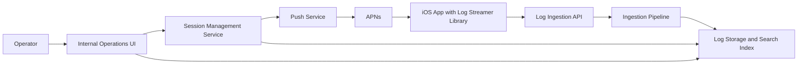
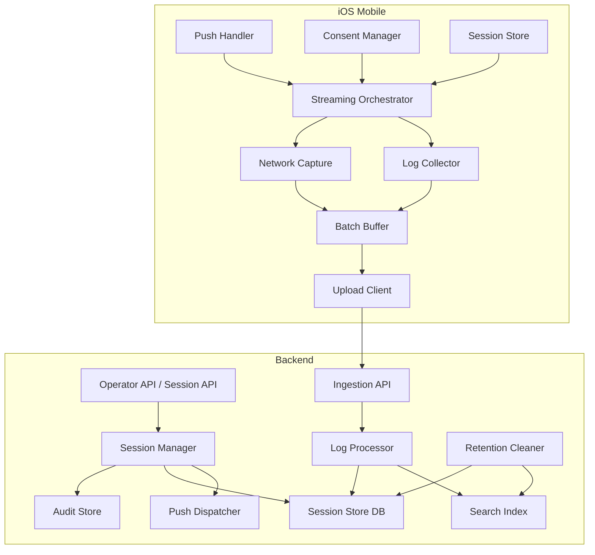
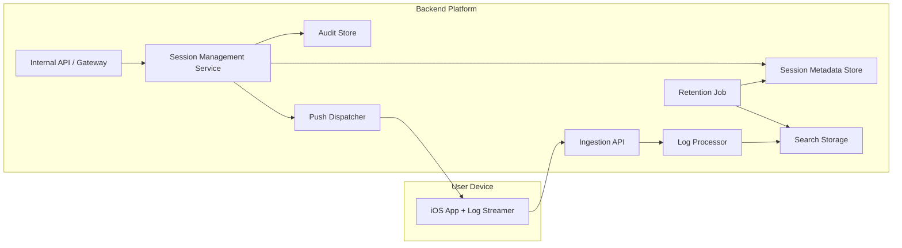

# High Level Design

## Title
Mobile Log Streamer Phase 1 High Level Design for iOS and Backend

## Document Status
Draft

## Prepared On
June 28, 2026

## Source Documents

- [BRD-mobile-log-streamer.md](/Users/atiqaakif/Documents/logs_stream/BRD-mobile-log-streamer.md)
- [PRD-mobile-log-streamer.md](/Users/atiqaakif/Documents/logs_stream/PRD-mobile-log-streamer.md)

## Purpose
This document defines the high level architecture for the phase 1 Mobile Log Streamer solution. It covers the iOS mobile library, backend services, server-side storage and search, operational UI, and the major runtime flows between them.

This HLD is intentionally high level. It describes components, responsibilities, interfaces, and lifecycle behavior without locking the implementation to a specific framework, database, or deployment stack.

## Phase 1 Scope

- iOS only
- Push-triggered start and stop
- Single active session per device
- App logs and network logs
- Foreground-only streaming
- Consent prompt before logging begins
- Session persistence across app relaunch
- Searchable logs by `sessionId`
- Live internal operational UI
- Default retention of 24 hours

## Non-Goals

- Android client design
- RBAC in phase 1
- Full low-level API contracts
- Background-only streaming
- Long-term analytics platform design

## Design Goals

- Keep the mobile client lightweight and isolated from app business logic
- Centralize session control in the backend
- Make session lifecycle explicit and observable
- Protect user data through consent, redaction, and short retention
- Allow future extension to Android and stronger access control without redesigning the core model

## Assumptions

- The iOS app already supports remote push delivery.
- The app can persist a small amount of local session state.
- The backend can map a target device to a push destination.
- The internal operator UI can call backend APIs directly or through an internal gateway.
- Full network payload capture is permitted only when enabled by configuration and covered by consent.

## System Context

## Architecture Overview

The phase 1 solution is composed of five major parts:

1. `iOS App + Log Streamer Library`
2. `Session Management Service`
3. `Push Service Integration`
4. `Log Ingestion and Processing Layer`
5. `Internal Operations UI`

The session lifecycle is controlled by the backend, while log generation and upload happen on the client only after user consent. The backend is responsible for issuing session IDs, pushing start or stop instructions, receiving logs, exposing session state, and enforcing retention.

## Logical Components

## End-to-End Lifecycle

### Start Session

1. Operator creates a logging session from the internal UI.
2. Session Management Service creates a unique `sessionId`.
3. Backend stores session metadata and state as `pending`.
4. Backend sends a start push to the iOS device with session instructions.
5. App receives the push.
6. Log Streamer library validates the request and shows a consent prompt.
7. If user accepts, library persists the session locally and starts streaming in foreground.
8. Client uploads logs in batches to the ingestion API.
9. Backend marks session `active` once valid logs are received.

### Stop Session

1. Operator or backend stop logic decides the session should end.
2. Backend sends a stop push to the client.
3. Client flushes buffered logs and closes the session.
4. Backend marks the session `completed`.

### Resume After Relaunch

1. App relaunches while the session is still active.
2. Library restores local session state.
3. When the app enters foreground again, logging resumes automatically.
4. No second consent prompt is shown for the same active session.

### Consent Denied

1. User declines the consent prompt.
2. Client does not start collection.
3. Backend records session status as `cancelled`.

## Mobile HLD

### Mobile Objectives

- Encapsulate logging behavior in a reusable library
- Avoid coupling to app feature code
- Limit logging to foreground execution
- Resume safely after app relaunch
- Support app logs and network logs under a shared session model

### Mobile Component Design

### 1. Push Handler
Responsible for receiving start and stop push payloads and forwarding them to the library orchestration layer.

Responsibilities:

- Parse push payload
- Distinguish start vs stop command
- Extract `sessionId` and high-level instructions
- Hand control to the `Streaming Orchestrator`

### 2. Streaming Orchestrator
Central state machine inside the library.

Responsibilities:

- Validate whether a new session can start
- Enforce single active session per device
- Coordinate consent, collectors, buffer, and upload client
- Transition state between `pending`, `consent_requested`, `active`, `paused`, and `completed`
- React to app lifecycle changes

### 3. Consent Manager
Responsible for showing and recording user consent status for the active session.

Responsibilities:

- Present the consent UI
- Persist consent result for the session
- Block collection if consent is denied
- Prevent repeated prompts for the same session after relaunch

### 4. Session Store
Persistent local session storage.

Responsibilities:

- Store active `sessionId`
- Store consent result
- Store session configuration relevant to client behavior
- Restore session after app relaunch
- Clear state when session completes or expires

Suggested data stored locally:

- `sessionId`
- session status
- consent accepted flag
- start timestamp
- stop configuration payload
- configuration hash or version

### 5. Log Collector
Collects application logs from the host app and the shared library.

Responsibilities:

- Subscribe to app logging pipeline
- Normalize log entries
- Attach required metadata
- Forward events to the batch buffer

### 6. Network Capture
Captures network events relevant to the active session.

Responsibilities:

- Intercept outgoing and incoming network activity
- Capture request and response metadata
- Capture headers and bodies when enabled
- Apply client-side redaction hooks before buffering

### 7. Batch Buffer
Short-lived in-memory and optional lightweight persisted queue for upload.

Responsibilities:

- Batch logs into upload payloads
- Reduce request count
- Retry on transient network failure
- Flush on stop

Phase 1 recommendation:

- Use memory-first batching
- Keep persistence minimal
- Avoid designing a heavy offline store because logging is foreground only

### 8. Upload Client
Uploads logs to the ingestion API.

Responsibilities:

- Authenticate requests
- Attach session metadata
- Send batched events
- Retry transient failures with backoff
- Stop retrying when session ends

### Mobile Runtime Behavior

### App Foreground

- If an active session exists and consent is granted, collection runs
- App logs and network logs are captured
- Logs are batched and uploaded

### App Background

- Collection pauses
- No new foreground-only logs are streamed
- Active session state remains persisted locally

### App Relaunch

- Session state is restored
- If session is still active, logging resumes on foreground entry

### Stop Push Received

- Upload client flushes pending events
- Local session state is cleared
- Collectors detach

### Mobile Boundaries

The mobile library should not own:

- Operator-facing business rules
- Session authorization decisions
- Long-term storage decisions
- Search capabilities
- Global stop logic for all sessions

These remain backend responsibilities.

## Backend HLD

### Backend Objectives

- Centralize control of session lifecycle
- Provide searchable visibility into sessions and logs
- Decouple session management from log ingestion
- Make retention, auditing, and observability first-class concerns

### Backend Services

### 1. Session Management Service
Primary control plane for logging sessions.

Responsibilities:

- Create session records
- Generate unique `sessionId`
- Validate device targeting rules
- Maintain session lifecycle state
- Trigger start and stop pushes
- Expose session status to the internal UI
- Record operator actions

Suggested session states:

- `pending`
- `consent_requested`
- `active`
- `paused`
- `completed`
- `cancelled`
- `failed`
- `expired`

### 2. Push Dispatcher
Service or module responsible for integration with APNs.

Responsibilities:

- Build start push payload
- Build stop push payload
- Deliver pushes through APNs
- Handle retry or resend trigger from operator action
- Record delivery attempt metadata

### 3. Log Ingestion API
Data plane entry point for uploaded logs.

Responsibilities:

- Authenticate client upload request
- Validate `sessionId`
- Validate payload size and format
- Accept batched log events
- Return lightweight acknowledgment

The ingestion API should remain stateless so it can scale horizontally.

### 4. Log Processor
Processes accepted log batches before indexing or storage.

Responsibilities:

- Normalize records
- Enrich with server-side metadata
- Validate session state
- Apply server-side redaction or policy checks
- Route records to search storage
- Update session health metrics

### 5. Log Storage and Search
Stores logs for short-term operational search.

Responsibilities:

- Index logs by `sessionId`
- Support live-view queries
- Support 24-hour retention
- Support operational troubleshooting

Phase 1 recommendation:

- Optimize for append-heavy writes and session-based lookup
- Do not over-design multi-dimensional analytics in phase 1

### 6. Audit Store
Maintains operator and system action history.

Responsibilities:

- Record session creation
- Record resend operations
- Record stop operations
- Record consent-denied or cancellation signals

### 7. Retention Cleaner
Background cleanup component.

Responsibilities:

- Delete or expire logs after retention window
- Update session records if needed
- Ensure expired data is not returned by search

### Backend Data Model

### Session Entity

Recommended top-level fields:

- `sessionId`
- `deviceId` or install identifier
- target app identifier
- environment
- current status
- consent status
- created by
- created at
- activated at
- ended at
- stop policy
- retention policy
- resend count
- last client activity timestamp

### Log Event Entity

Recommended top-level fields:

- `sessionId`
- event timestamp
- ingest timestamp
- log type: app or network
- severity or level
- component or module
- payload body
- metadata map

### Audit Entity

Recommended top-level fields:

- action type
- `sessionId`
- actor
- timestamp
- details

### Backend APIs at High Level

### Operator Control APIs

- `createSession`
- `getSession`
- `listSessions`
- `stopSession`
- `resendPush`

### Search APIs

- `getLogsBySessionId`
- `streamSessionLogs`

### Client Upload API

- `uploadLogs`

Exact request and response schemas are intentionally left for low-level design.

## Internal UI HLD

The internal UI is a thin operational client over the backend control and search APIs.

Responsibilities:

- Create a session
- Display session state
- Show live log stream
- Search by `sessionId`
- Trigger resend
- Trigger manual stop

Phase 1 UI should stay intentionally simple:

- session list
- session detail
- live log panel
- resend action
- stop action

## Cross-Cutting Concerns

### Security and Privacy

- All client-to-server communication uses TLS
- Push payloads should be signed or otherwise verifiable
- Server validates session legitimacy before accepting logs
- Client-side redaction hooks apply before upload
- Server-side policy enforcement provides a second control layer
- Full network payload capture must be explicitly enabled by configuration
- Consent must be captured before upload begins

### Observability

Metrics recommended for phase 1:

- session created count
- push sent count
- push resend count
- consent accepted count
- consent denied count
- session active count
- first log latency
- log upload success/failure rate
- stop success rate

Logs and traces should exist for:

- session lifecycle transitions
- push attempts
- ingestion failures
- retention cleanup

### Scalability

Phase 1 does not require extreme scale, but the design should still separate:

- control plane: session lifecycle and push orchestration
- data plane: log ingestion and storage

This split allows ingestion to scale independently from session management.

### Reliability and Failure Handling

### Start Push Not Delivered

- Session remains `pending`
- Operator sees no log activity
- Operator can trigger resend

### Consent Denied

- Session moves to `cancelled`
- No collection begins

### Client Upload Failure

- Batch buffer retries transient errors
- Session remains active until stop or expiry policy applies

### Stop Push Not Delivered

- Session continues until configured backup stop rule triggers or operator resends stop

### App Relaunch

- Client restores local state
- Logging resumes on foreground if session is still active

## Deployment View

## Recommended Phase 1 Separation of Ownership

### Mobile Team

- iOS library
- consent UX integration
- app log integration
- network capture integration
- local session persistence
- upload client

### Backend Team

- session lifecycle APIs
- push integration
- ingestion API
- log storage and search
- operational UI
- retention and audit

## Extension Path for Later Phases

- Add Android client with the same session model
- Add RBAC to operator APIs and UI
- Add richer search filters beyond `sessionId`
- Add more log categories such as breadcrumbs or feature flag snapshots
- Add cost controls and stronger policy-based sampling if needed

## Open Items for Low-Level Design

- Exact push payload schema
- Exact client upload authentication method
- Exact local persistence format on iOS
- Exact network interception implementation
- Exact storage engine and search engine choice
- Exact retry and backoff policy
- Exact redaction rules and field classification

## Recommendation
Proceed to a low-level technical design with two parallel tracks:

1. iOS library design for session state machine, network interception, batching, and consent flow
2. Backend service design for session APIs, APNs integration, ingestion contract, storage schema, and live search delivery
