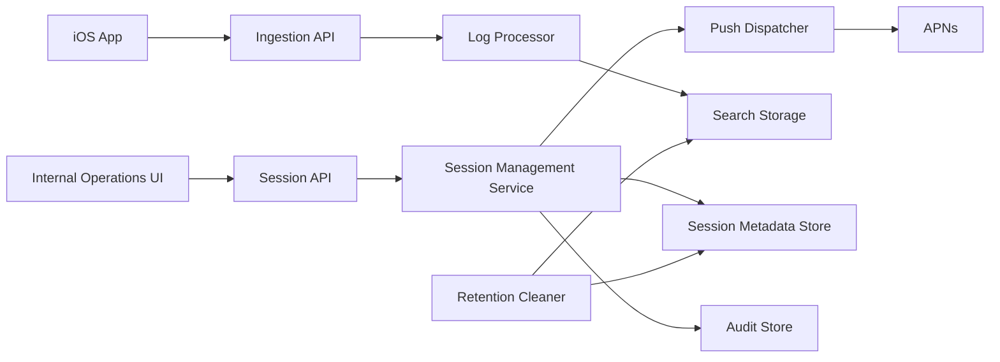
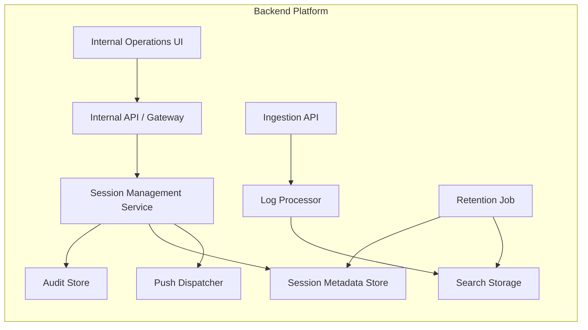

# High Level Design

## Title
Mobile Log Streamer Phase 1 HLD for Backend

## Document Status
Draft

## Prepared On
June 28, 2026

## Source Documents

- [BRD-mobile-log-streamer.md](/Users/atiqaakif/Documents/logs_stream/BRD-mobile-log-streamer.md)
- [PRD-mobile-log-streamer.md](/Users/atiqaakif/Documents/logs_stream/PRD-mobile-log-streamer.md)
- [HLD-mobile-be-log-streamer.md](/Users/atiqaakif/Documents/logs_stream/HLD-mobile-be-log-streamer.md)

## Purpose
This document defines the phase 1 high level design for the backend side of the Mobile Log Streamer solution. It focuses on session lifecycle management, push orchestration, log ingestion, searchable storage, retention, and the internal operational UI.

## Phase 1 Scope

- Session creation and lifecycle control
- Push-triggered start and stop
- Searchable logs by `sessionId`
- Live internal operational UI
- 24-hour default retention
- Auditability for key operator and system actions
- One app in phase 1, with future multi-app support designed into metadata

## Design Goals

- Centralize session control in one backend control plane
- Separate control plane from data plane
- Keep ingestion horizontally scalable
- Provide simple but reliable operator visibility
- Make retention and audit first-class concerns
- Choose infrastructure that supports operational search now and AI-assisted analysis later

## Non-Goals

- RBAC in phase 1
- Android-specific backend behavior
- Historical analytics platform
- Rich multi-field search beyond immediate phase 1 needs

## Backend Architecture Overview

## Main Services

### 1. Session Management Service
Primary backend control plane for session orchestration.

Responsibilities:

- Create session records
- Generate unique `sessionId`
- Generate short-lived upload session token
- Maintain session state
- Trigger start and stop push actions
- Expose session information to the internal UI
- Track resend and stop actions

Suggested session states:

- `pending`
- `consent_requested`
- `active`
- `paused`
- `completed`
- `cancelled`
- `failed`
- `expired`

### 2. Push Dispatcher
Handles delivery of start and stop instructions to APNs.

Responsibilities:

- Build start push payload
- Build stop push payload
- Send pushes through APNs
- Record delivery attempts
- Support operator-driven resend
- Include session expiry after backend-configured `N` minutes as default backup stop behavior

### 3. Ingestion API
Stateless entry point for client log uploads.

Responsibilities:

- Authenticate client uploads using a short-lived backend-generated session token
- Validate `sessionId`
- Validate request size and structure
- Accept batched events
- Return acknowledgment quickly

Design direction:

- Keep the service stateless
- Scale horizontally behind a load balancer if needed

### 4. Log Processor
Processes events after ingestion.

Responsibilities:

- Normalize records
- Enrich with backend metadata
- Validate session status
- Apply server-side policy checks
- Apply final server-side redaction enforcement
- Forward records to search storage
- Update session activity markers

### 5. Search Storage
Stores logs for short-term operational usage.

Responsibilities:

- Index logs by `sessionId`
- Support live-view access patterns
- Support 24-hour retention
- Support troubleshooting queries

Phase 1 guidance:

- Optimize for append-heavy writes
- Optimize for session-based retrieval
- Avoid over-designing analytics behavior
- Recommended phase 1 choice is an OpenSearch-compatible document store because it fits log indexing, session search, near real-time visibility, and future AI-oriented retrieval better than a plain relational model

### 6. Session Metadata Store
Stores non-log session information.

Responsibilities:

- Store lifecycle state
- Store targeting and operator metadata
- Store retention and stop policy
- Store latest session activity metadata

Recommended targeting fields:

- `deviceId`
- `installationId`
- `userId`
- target app identifier

### 7. Audit Store
Stores important operator and system actions.

Responsibilities:

- Record session creation
- Record resend actions
- Record stop actions
- Record cancellation and failure signals

### 8. Retention Cleaner
Background cleanup process.

Responsibilities:

- Expire logs after retention window
- Mark session expiration where relevant
- Ensure expired data is not returned by search

### 9. Internal Operations UI
Thin operational interface over the backend services.

Responsibilities:

- Create sessions
- Show session status
- Show live log stream
- Search by `sessionId`
- Trigger resend
- Trigger manual stop
- Show all active sessions prominently
- Show session history list so operators can select any recent session for review

## Core Runtime Flows

### Create and Start Session

1. Operator creates a session from the UI.
2. Session Management Service creates a unique `sessionId`.
3. Session Management Service generates a short-lived upload session token.
4. Session state is stored as `pending`.
5. Push Dispatcher sends start push via APNs.
6. When the app confirms the consent prompt was shown, backend moves the session to `consent_requested`.
7. When client logs arrive, session becomes `active`.

### Consent Denied

1. Client declines consent.
2. Client sends an explicit cancellation event.
3. Session is marked `cancelled`.
4. UI shows cancelled state.

### Stop Session

1. Operator or backend stop policy decides the session should end.
2. Push Dispatcher sends stop push.
3. Backend receives final uploads or stop signal.
4. Session is marked `completed`.

### Stop Push Failure

1. Stop push is not delivered or no client response is observed.
2. Default expiry after backend-configured `N` minutes applies unless overridden for that session.
3. Operator may resend stop if needed.

## Backend Data Model

### Session Entity

Recommended fields:

- `sessionId`
- upload session token reference
- target device or install identifier
- target `userId` when available
- target app identifier
- environment
- current status
- consent status
- created by
- created at
- activated at
- ended at
- stop policy
- retention policy
- resend count
- last client activity timestamp

### Log Event Entity

Recommended fields:

- `sessionId`
- event timestamp
- ingest timestamp
- log type
- severity
- component
- payload body
- metadata map
- app identifier

### Audit Entity

Recommended fields:

- action type
- actor
- `sessionId`
- timestamp
- details

## Backend APIs at High Level

### Operator APIs

- `createSession`
- `getSession`
- `listSessions`
- `stopSession`
- `resendPush`

### Search APIs

- `getLogsBySessionId`
- `streamSessionLogs`

### Client APIs

- `uploadLogs`

Exact schemas are left for low-level design.

### Live Log Delivery Recommendation

- Use Server-Sent Events for phase 1 live log delivery to the UI

Reason:

- The UI needs one-way near real-time updates from backend to browser
- SSE is easier to operate than WebSockets for this use case
- It is sufficient for session-centric live log streaming

## Internal UI Design Scope

Phase 1 UI should stay intentionally simple:

- session list
- session detail
- live log panel
- resend action
- stop action
- active sessions panel

UI requirements:

- search by `sessionId` only
- clear status visibility
- clear distinction between `cancelled` and `failed`
- near real-time log updates
- show both all active sessions and recent session history within retention window

## Security and Privacy

- All APIs use TLS
- Session legitimacy is validated before accepting logs
- Push payloads should be signed or otherwise verifiable
- Client-side redaction is the first filter, but backend is the final enforcement layer
- Full network payload capture must be configuration controlled
- Retention defaults to 24 hours

## Observability

Recommended backend metrics:

- session created count
- push sent count
- push resend count
- consent accepted count
- consent denied count
- session active count
- first log latency
- ingestion success and failure count
- stop success rate
- retention cleanup count

Recommended operational logs and traces:

- session lifecycle transitions
- push delivery attempts
- ingestion validation failures
- search query failures
- retention cleanup runs

## Scalability

Phase 1 should separate:

- control plane: session lifecycle and push orchestration
- data plane: ingestion, processing, and search storage

This allows ingestion to scale independently from session management.

## Reliability and Failure Handling

### Start Push Not Delivered

- Session remains `pending`
- No logs appear
- Operator can resend

### No Logs After Start

- UI should show lack of activity clearly
- Operator can resend or inspect whether consent was denied

### Ingestion Failure

- Stateless API nodes can be retried at the client layer
- Processing failures should be observable and isolated

### Stop Push Not Delivered

- Session relies on configured backup stop behavior
- Operator resend remains available

### Retention Cleanup Failure

- Cleanup jobs must be observable
- Backlog should be recoverable without corrupting session metadata

## Deployment View

## Ownership

Expected backend team ownership:

- session lifecycle APIs
- push integration
- ingestion API
- log processing
- search storage
- operational UI
- audit and retention

## Open Items for LLD

- Exact push payload schema
- Exact upload authentication model
- Exact session metadata schema
- Exact OpenSearch-compatible deployment choice and index strategy
- Exact SSE delivery implementation for the UI
- Exact retention cleanup strategy

## Recommendation
Proceed to a backend low-level design for session APIs, APNs integration, ingestion contract, session schema, short-term search storage, live-view delivery, and retention processing.
