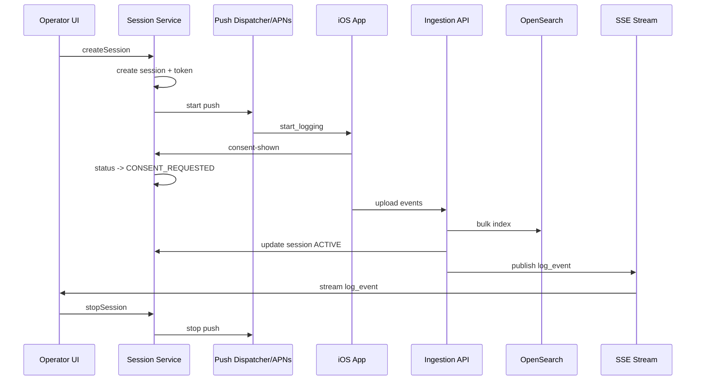

# Low Level Design

## Title
Mobile Log Streamer Phase 1 LLD for Backend

## Document Status
Draft

## Prepared On
June 28, 2026

## Source Documents

- [BRD-mobile-log-streamer.md](/Users/atiqaakif/Documents/logs_stream/BRD-mobile-log-streamer.md)
- [PRD-mobile-log-streamer.md](/Users/atiqaakif/Documents/logs_stream/PRD-mobile-log-streamer.md)
- [HLD-backend-log-streamer.md](/Users/atiqaakif/Documents/logs_stream/be/HLD-backend-log-streamer.md)

## Purpose
This document converts the backend HLD into implementation-level design for phase 1.

## Technology Decisions

- Primary backend language: `Java 21`
- Framework: `Spring Boot 3.x`
- Request model: `Spring MVC` with virtual threads enabled
- Metadata store: `PostgreSQL`
- Log store and search: `OpenSearch-compatible document store`
- Live log stream to UI: `Server-Sent Events`
- Build tool: `Gradle`

## Why This Stack

- Java 21 fits long-running platform services and session orchestration well
- Virtual threads keep code simple while supporting I/O-heavy traffic
- PostgreSQL is a strong fit for session metadata and audit records
- OpenSearch is a strong fit for append-heavy log indexing and future AI retrieval use cases
- SSE is sufficient for one-way live session log updates and is easier to operate than WebSockets for phase 1

## Service Layout

```text
backend/
  session-service/
    api/
    application/
    domain/
    infrastructure/
  ingestion-service/
    api/
    application/
    domain/
    infrastructure/
  shared/
    auth/
    events/
    observability/
```

For phase 1, these can run in one deployable application with clear internal module boundaries.

## Proposed Java Package Structure

```text
com.company.logstreamer
  session
    api
    application
    domain
    persistence
  push
    application
    apns
  ingest
    api
    application
    domain
  search
    application
    opensearch
  audit
    application
    persistence
  stream
    sse
  auth
  config
```

## Core Domain Model

### SessionStatus

```java
public enum SessionStatus {
    PENDING,
    CONSENT_REQUESTED,
    ACTIVE,
    PAUSED,
    COMPLETED,
    CANCELLED,
    FAILED,
    EXPIRED
}
```

### ConsentStatus

```java
public enum ConsentStatus {
    UNKNOWN,
    SHOWN,
    ACCEPTED,
    DENIED
}
```

### StopPolicy

```java
public record StopPolicy(
    Integer expiresAfterMinutes,
    Integer maxEvents,
    Long maxBytes
) {}
```

### Session Aggregate

```java
public class LogSession {
    UUID id;
    String sessionId;
    String appId;
    String environment;
    String deviceId;
    String installationId;
    String userId;
    SessionStatus status;
    ConsentStatus consentStatus;
    String uploadTokenHash;
    Instant uploadTokenExpiresAt;
    StopPolicy stopPolicy;
    Integer retentionHours;
    String createdBy;
    Instant createdAt;
    Instant consentShownAt;
    Instant activatedAt;
    Instant endedAt;
    Instant lastClientActivityAt;
    Integer resendCount;
}
```

## Metadata Schema

### Table: `log_session`

| Column | Type | Notes |
|---|---|---|
| `id` | `uuid` | PK |
| `session_id` | `varchar(64)` | unique |
| `app_id` | `varchar(100)` | one app now, future multi-app |
| `environment` | `varchar(50)` | prod, stage |
| `device_id` | `varchar(128)` | nullable |
| `installation_id` | `varchar(128)` | nullable |
| `user_id` | `varchar(128)` | nullable |
| `status` | `varchar(32)` | indexed |
| `consent_status` | `varchar(32)` | indexed |
| `upload_token_hash` | `varchar(255)` | never store raw token |
| `upload_token_expires_at` | `timestamp` | indexed |
| `stop_policy_json` | `jsonb` | stop rules |
| `retention_hours` | `int` | default 24 |
| `created_by` | `varchar(128)` | operator or system |
| `created_at` | `timestamp` | indexed |
| `consent_shown_at` | `timestamp` | nullable |
| `activated_at` | `timestamp` | nullable |
| `ended_at` | `timestamp` | nullable |
| `last_client_activity_at` | `timestamp` | indexed |
| `resend_count` | `int` | default 0 |

### Table: `session_audit`

| Column | Type | Notes |
|---|---|---|
| `id` | `uuid` | PK |
| `session_id` | `varchar(64)` | indexed |
| `action_type` | `varchar(64)` | indexed |
| `actor` | `varchar(128)` | operator or system |
| `details_json` | `jsonb` | arbitrary details |
| `created_at` | `timestamp` | indexed |

## OpenSearch Index Design

### Index Pattern

- `mobile-log-events-v1-YYYY.MM.DD`

### Indexed Fields

- `sessionId` keyword
- `appId` keyword
- `eventType` keyword
- `level` keyword
- `component` keyword
- `timestamp` date
- `ingestedAt` date
- `deviceId` keyword
- `installationId` keyword
- `userId` keyword
- `message` text + keyword subfield
- `metadata.*` keyword where practical
- `payload` object, not full-text analyzed by default

### Mapping Direction

- use `keyword` for IDs and exact filters
- use `date` for time fields
- use `text` only for searchable message fields
- keep large bodies stored but minimally analyzed to control index cost

## APIs

### Operator APIs

### `POST /api/v1/sessions`

Creates a new logging session.

Request:

```json
{
  "appId": "consumer-ios",
  "environment": "prod",
  "deviceId": "device-123",
  "installationId": "install-123",
  "userId": "user-123",
  "logLevel": "INFO",
  "captureNetworkBodies": true,
  "stopPolicy": {
    "expiresAfterMinutes": 15,
    "maxEvents": null,
    "maxBytes": null
  },
  "retentionHours": 24
}
```

Response:

```json
{
  "sessionId": "sess_01JXYZ",
  "status": "PENDING",
  "createdAt": "2026-06-28T10:00:00Z"
}
```

### `GET /api/v1/sessions`

Query params:

- `status`
- `activeOnly`
- `limit`
- `cursor`

### `GET /api/v1/sessions/{sessionId}`

Returns session metadata and current state.

### `POST /api/v1/sessions/{sessionId}/stop`

Manually requests stop for a session.

### `POST /api/v1/sessions/{sessionId}/resend`

Resends start or stop push depending on session state.

### Client APIs

### `POST /api/v1/mobile/sessions/{sessionId}/consent-shown`

Headers:

- `Authorization: Bearer <uploadToken>`

Request:

```json
{
  "shownAt": "2026-06-28T10:00:10Z"
}
```

Behavior:

- validate token and session
- move `PENDING` to `CONSENT_REQUESTED`
- idempotent for repeated calls

### `POST /api/v1/mobile/sessions/{sessionId}/cancel`

Request:

```json
{
  "cancelledAt": "2026-06-28T10:00:25Z",
  "reason": "USER_DENIED_CONSENT"
}
```

Behavior:

- move `PENDING` or `CONSENT_REQUESTED` to `CANCELLED`
- write audit record

### `POST /api/v1/mobile/sessions/{sessionId}/events`

Request:

```json
{
  "sentAt": "2026-06-28T10:00:30Z",
  "events": [
    {
      "eventId": "evt_1",
      "timestamp": "2026-06-28T10:00:29Z",
      "type": "app",
      "level": "INFO",
      "component": "CheckoutViewModel",
      "message": "Checkout started",
      "metadata": {
        "screen": "checkout"
      },
      "payload": null
    }
  ]
}
```

Response:

```json
{
  "accepted": 1,
  "rejected": 0,
  "status": "ACTIVE"
}
```

Behavior:

- validate bearer token
- validate session exists and is not ended
- transition session to `ACTIVE` on first successful event batch if currently `CONSENT_REQUESTED`
- write events to OpenSearch
- update `lastClientActivityAt`
- publish events to SSE broadcaster

### Search APIs

### `GET /api/v1/sessions/{sessionId}/logs`

Query params:

- `from`
- `to`
- `cursor`
- `limit`

### `GET /api/v1/sessions/{sessionId}/stream`

Response type:

- `text/event-stream`

SSE events:

- `session_status`
- `log_event`
- `heartbeat`

## Token Design

### Upload Token

- generated at session creation
- opaque random token returned only in push payload
- stored hashed in PostgreSQL
- short-lived, default expiry aligned to session stop policy

Validation flow:

1. extract bearer token
2. hash token
3. find session by `sessionId`
4. compare hash
5. confirm token not expired

## Push Payload Design

### Start Push

```json
{
  "command": "start_logging",
  "sessionId": "sess_01JXYZ",
  "appId": "consumer-ios",
  "environment": "prod",
  "uploadToken": "raw-short-lived-token",
  "logLevel": "INFO",
  "captureNetworkBodies": true,
  "retentionHours": 24,
  "stopPolicy": {
    "expiresAfterMinutes": 15,
    "maxEvents": null,
    "maxBytes": null
  },
  "issuedAt": "2026-06-28T10:00:00Z",
  "expiresAt": "2026-06-28T10:15:00Z",
  "signature": "signed-value"
}
```

### Stop Push

```json
{
  "command": "stop_logging",
  "sessionId": "sess_01JXYZ",
  "issuedAt": "2026-06-28T10:10:00Z",
  "signature": "signed-value"
}
```

## Application Services

### `SessionCommandService`

Methods:

- `createSession(CreateSessionRequest request)`
- `markConsentShown(String sessionId, String token, Instant shownAt)`
- `markCancelled(String sessionId, String token, CancelRequest request)`
- `stopSession(String sessionId, StopSource source)`
- `resendPush(String sessionId, PushType pushType)`
- `expireSessions()`

### `EventIngestionService`

Methods:

- `ingest(String sessionId, String token, EventBatchRequest request)`

Steps:

1. validate auth
2. validate session status
3. normalize events
4. apply backend redaction
5. bulk index to OpenSearch
6. update session activity
7. publish to SSE broadcaster

### `PushDispatchService`

Methods:

- `sendStartPush(LogSession session)`
- `sendStopPush(LogSession session)`

## Live Stream Design

### Chosen Approach

- SSE endpoint per session
- internal broadcaster keyed by `sessionId`

### Phase 1 Implementation Option

- `SseEmitter` registry in memory
- `SessionEventPublisher` publishes new events to local listeners

### Scaling Note

If multiple backend nodes are used, local in-memory publishing must be replaced or backed by a shared bus such as Redis pub/sub. Keep publisher interface abstract so this swap is easy.

Interfaces:

```java
interface SessionEventPublisher {
    void publishLogEvent(String sessionId, LogEventView event);
    void publishSessionStatus(String sessionId, SessionStatusView status);
}
```

## Session State Rules

### Allowed Transitions

| Current | Event | Next |
|---|---|---|
| `PENDING` | consent shown | `CONSENT_REQUESTED` |
| `CONSENT_REQUESTED` | first valid logs | `ACTIVE` |
| `PENDING` | cancel | `CANCELLED` |
| `CONSENT_REQUESTED` | cancel | `CANCELLED` |
| `ACTIVE` | manual stop | `COMPLETED` |
| `ACTIVE` | stop push confirmed or final flush | `COMPLETED` |
| `ACTIVE` | expiry job | `EXPIRED` |
| `CONSENT_REQUESTED` | expiry job | `EXPIRED` |

Rules:

- `CANCELLED`, `COMPLETED`, and `EXPIRED` are terminal
- repeated consent shown is idempotent
- repeated cancel after terminal cancellation returns success without mutation
- repeated stop after terminal completion returns success without mutation

## Background Jobs

### Expiry Job

Frequency:

- every `1 minute`

Behavior:

- find sessions whose stop policy expiry has passed
- mark them `EXPIRED` if not terminal
- optionally send stop push once before final expiry marking

### Retention Job

Frequency:

- every `15 minutes`

Behavior:

- delete OpenSearch documents older than retention threshold
- mark cleanup audit entries

## Observability

### Metrics

- `sessions.created`
- `sessions.active`
- `sessions.cancelled`
- `sessions.expired`
- `push.start.sent`
- `push.stop.sent`
- `push.resend.count`
- `ingest.requests`
- `ingest.events.accepted`
- `ingest.events.rejected`
- `ingest.latency`
- `search.sse.connections`

### Structured Logs

All services should log:

- `sessionId`
- `appId`
- `environment`
- `requestId`
- `operatorId` where applicable

## Security Design

- operator APIs protected by internal auth layer
- mobile APIs use upload session token only
- raw upload token never stored in plain text
- push payloads signed
- backend always performs final redaction enforcement
- request bodies containing secrets can be masked before indexing while optionally stored in a restricted raw field only if policy later requires it

## Error Model

### API Error Codes

- `SESSION_NOT_FOUND`
- `INVALID_UPLOAD_TOKEN`
- `SESSION_ALREADY_TERMINAL`
- `SESSION_STATE_INVALID`
- `PUSH_DELIVERY_FAILED`
- `INGEST_PAYLOAD_INVALID`
- `INGEST_TOO_LARGE`
- `SEARCH_BACKEND_UNAVAILABLE`

### HTTP Guidance

- `400` invalid payload
- `401` invalid token or auth
- `404` session not found
- `409` invalid state transition
- `413` payload too large
- `500` unexpected internal failure
- `503` dependent system unavailable

## Sequence Diagram



## Testing Strategy

### Unit Tests

- session transition rules
- token hashing and validation
- stop policy evaluation
- retention cutoff logic
- OpenSearch document mapping builders

### Integration Tests

- create session to active upload
- consent shown transition
- cancel transition
- stop session transition
- SSE live stream from ingested event
- expiry job transition

### Contract Tests

- push payload generation
- mobile upload request schema
- operator API schema

## Open Items

- exact operator auth integration
- whether SSE fan-out stays single-node in phase 1 or uses shared pub/sub from day one
- final OpenSearch index template details
- final payload-too-large policy for single oversized event bodies

## Recommendation
Proceed to implementation with one Spring Boot deployment containing modular session, push, ingest, search, and SSE packages, backed by PostgreSQL and OpenSearch, with a later option to split services physically if scale requires it.
