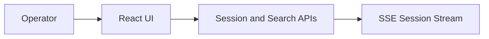
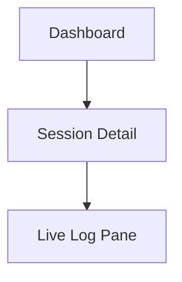

# High Level Design

## Title
Mobile Log Streamer Phase 1 HLD for Internal Log View UI

## Document Status
Draft

## Prepared On
June 28, 2026

## Source Documents

- [PRD-mobile-log-streamer.md](/Users/atiqaakif/Documents/logs_stream/PRD-mobile-log-streamer.md)
- [HLD-backend-log-streamer.md](/Users/atiqaakif/Documents/logs_stream/be/HLD-backend-log-streamer.md)
- [LLD-backend-log-streamer.md](/Users/atiqaakif/Documents/logs_stream/be/LLD-backend-log-streamer.md)

## Purpose
This document defines the high level design for the internal frontend used to operate and view mobile log streaming sessions in phase 1.

## Phase 1 Scope

- Internal web UI only
- Session list and active sessions view
- Session detail view
- Live log stream for a selected session
- Search by `sessionId` only
- Manual resend and stop actions
- Clear visibility of `pending`, `consent_requested`, `active`, `cancelled`, `completed`, `failed`, and `expired`

## Recommended Stack

- `React`
- `TypeScript`
- `Vite`
- Native `EventSource` for SSE

## Design Goals

- Keep operator workflow fast and simple
- Make active sessions visible immediately
- Make live logs easy to read without manual refresh
- Distinguish operational states clearly
- Keep the frontend thin over backend APIs

## Non-Goals

- Public end-user UI
- Advanced analytics dashboards
- Search by fields other than `sessionId` in phase 1
- Complex role-aware UI behavior in phase 1

## User Roles

Phase 1 treats internal operators as a single UI audience.

Primary users:

- Support engineers
- Mobile developers
- QA engineers
- SRE or platform operators

## UI Architecture Overview

## Main Screens

### 1. Sessions Dashboard

Purpose:

- show all active sessions prominently
- show recent session history
- allow quick selection of a session

Main content:

- active sessions panel
- recent sessions list
- session status badges
- session search by `sessionId`

### 2. Session Detail View

Purpose:

- display session metadata and current lifecycle state
- expose operator actions for that session

Main content:

- session summary
- target identifiers
- timestamps
- stop policy
- resend action
- stop action

### 3. Live Log View

Purpose:

- show near real-time logs for the selected session
- support active investigation while the session is running

Main content:

- log stream panel
- auto-scroll toggle
- pause live rendering toggle
- severity highlighting
- collapsible large payload sections

## Information Architecture

## Layout Direction

Recommended phase 1 layout:

- left column: active sessions and recent sessions
- top header: search, selected session status, actions
- main content: log viewer
- right metadata drawer or top metadata section: session information

## Core UI Components

### Session List

Responsibilities:

- show active sessions first
- show recent sessions within retention window
- allow selection of one session
- surface quick status at a glance

### Session Search

Responsibilities:

- accept `sessionId`
- route directly to selected session if found
- show empty state if not found

### Session Summary Card

Responsibilities:

- show `sessionId`
- show app and environment
- show target identifiers
- show status
- show created and updated time

### Action Bar

Responsibilities:

- resend start or stop
- manual stop
- refresh metadata if needed

### Live Log Panel

Responsibilities:

- connect to backend SSE stream
- append incoming events in order
- render logs efficiently
- preserve readability for long payloads

## Backend Integration Model

The frontend should remain a thin client over backend APIs:

- `GET /api/v1/sessions`
- `GET /api/v1/sessions/{sessionId}`
- `POST /api/v1/sessions/{sessionId}/stop`
- `POST /api/v1/sessions/{sessionId}/resend`
- `GET /api/v1/sessions/{sessionId}/logs`
- `GET /api/v1/sessions/{sessionId}/stream`

## State Model

### Page-Level State

- selected `sessionId`
- session metadata
- live connection status
- log list
- UI display preferences

### Connection State

- `connecting`
- `connected`
- `reconnecting`
- `disconnected`
- `error`

## Live Log Strategy

Phase 1 uses `SSE` because:

- log flow is one-way from backend to browser
- browser support is straightforward
- operational complexity is lower than WebSockets

Expected behavior:

- session detail loads initial log history from REST
- SSE appends new events
- if SSE drops, UI retries and shows connection status

## UX Requirements

- active sessions must be visible without navigation depth
- cancelled sessions must be visually distinct from failed sessions
- live logs must update without manual refresh
- large request and response bodies should be collapsed by default
- operator actions must be visible near session status
- empty and error states must be explicit

## Performance Considerations

- log list should support efficient rendering for long sessions
- avoid full-page rerenders when single log lines arrive
- preserve smooth scrolling during active streams

## Security Considerations

- UI is internal only
- auth is delegated to backend/internal auth layer
- UI must not persist sensitive log payloads in browser storage by default
- only minimal session selection state should persist locally

## Error Handling

The UI must handle:

- session not found
- SSE disconnected
- backend unavailable
- resend failure
- stop failure
- empty session with no logs

## Observability

Recommended frontend telemetry:

- page load success/failure
- session detail fetch failure
- SSE connect and disconnect counts
- resend action result
- stop action result

## Extension Path

- multi-app session filters
- richer log filtering
- inline AI summary panel
- diff between multiple sessions

## Recommendation
Proceed to a frontend LLD with concrete routes, component structure, client-side data flow, SSE hook design, and log rendering behavior.
