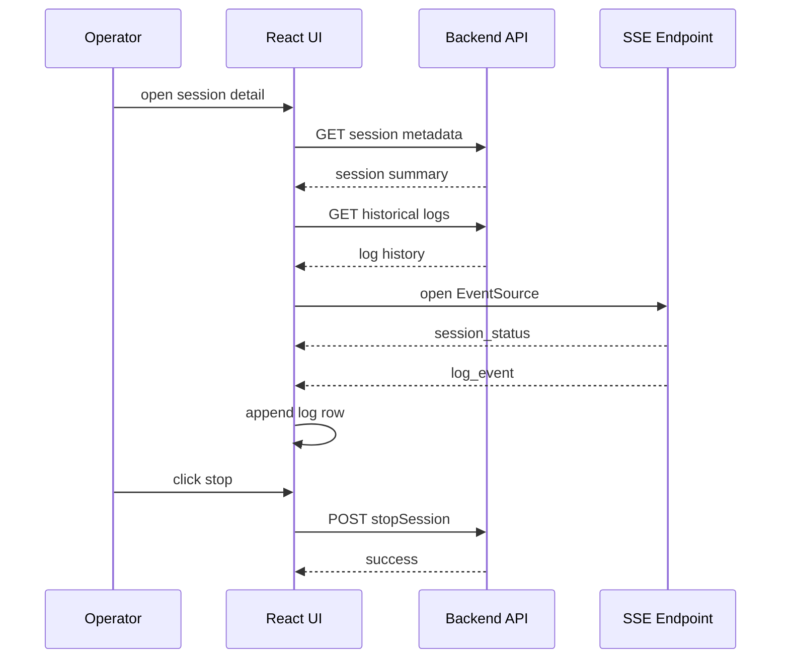

# Low Level Design

## Title
Mobile Log Streamer Phase 1 LLD for Internal Log View UI

## Document Status
Draft

## Prepared On
June 28, 2026

## Source Documents

- [HLD-ui-log-streamer.md](/Users/atiqaakif/Documents/logs_stream/fe/HLD-ui-log-streamer.md)
- [LLD-backend-log-streamer.md](/Users/atiqaakif/Documents/logs_stream/be/LLD-backend-log-streamer.md)

## Purpose
This document converts the UI HLD into implementation-level design for the phase 1 internal log viewer.

## Technology Decisions

- Framework: `React 18`
- Language: `TypeScript`
- Build tool: `Vite`
- Routing: `React Router`
- Server data fetching: `TanStack Query`
- Live stream transport: native `EventSource`
- Styling: CSS modules or scoped CSS with shared CSS variables
- Long-list rendering: virtualized log list recommended

## Why This Stack

- React fits session-centric, component-based operator workflows
- TypeScript reduces API and event-schema mistakes
- Vite keeps the internal app lightweight
- TanStack Query simplifies REST data fetching and caching
- EventSource is sufficient for one-way live logs

## Proposed App Structure

```text
ui/
  src/
    app/
      App.tsx
      router.tsx
      providers.tsx
    pages/
      DashboardPage.tsx
      SessionDetailPage.tsx
    components/
      layout/
      sessions/
      logs/
      actions/
      common/
    hooks/
      useSessions.ts
      useSessionDetail.ts
      useSessionLogs.ts
      useSessionStream.ts
      useAutoScroll.ts
    api/
      client.ts
      sessions.ts
      logs.ts
      stream.ts
    types/
      session.ts
      log.ts
      stream.ts
    styles/
      tokens.css
      globals.css
```

## Route Design

### `/`

Dashboard page showing:

- active sessions panel
- recent sessions list
- session search

### `/sessions/:sessionId`

Session detail page showing:

- session summary
- action bar
- live log view
- connection status

## Type Models

### SessionSummary

```ts
export type SessionStatus =
  | "PENDING"
  | "CONSENT_REQUESTED"
  | "ACTIVE"
  | "PAUSED"
  | "COMPLETED"
  | "CANCELLED"
  | "FAILED"
  | "EXPIRED";

export interface SessionSummary {
  sessionId: string;
  appId: string;
  environment: string;
  deviceId?: string;
  installationId?: string;
  userId?: string;
  status: SessionStatus;
  consentStatus: "UNKNOWN" | "SHOWN" | "ACCEPTED" | "DENIED";
  createdAt: string;
  activatedAt?: string;
  endedAt?: string;
  lastClientActivityAt?: string;
}
```

### LogEventView

```ts
export interface LogEventView {
  eventId: string;
  sessionId: string;
  timestamp: string;
  eventType: "app" | "networkRequest" | "networkResponse" | "lifecycle";
  level?: "DEBUG" | "INFO" | "WARN" | "ERROR";
  component: string;
  message?: string;
  metadata: Record<string, string>;
  payload?: unknown;
}
```

### SSE Event Types

```ts
export type StreamEvent =
  | { type: "session_status"; data: SessionSummary }
  | { type: "log_event"; data: LogEventView }
  | { type: "heartbeat"; data: { at: string } };
```

## Data Access Layer

### REST Client

Shared fetch wrapper responsibilities:

- attach internal auth headers if required
- normalize non-2xx errors
- parse JSON responses
- support abort signals

### API Methods

```ts
export async function getSessions(params?: {
  status?: string;
  activeOnly?: boolean;
  limit?: number;
  cursor?: string;
}): Promise<SessionSummary[]>;

export async function getSession(sessionId: string): Promise<SessionSummary>;

export async function stopSession(sessionId: string): Promise<void>;

export async function resendSessionPush(sessionId: string): Promise<void>;

export async function getSessionLogs(
  sessionId: string,
  params?: { cursor?: string; limit?: number; from?: string; to?: string }
): Promise<LogEventView[]>;
```

### SSE Client

### `useSessionStream(sessionId)`

Responsibilities:

- create `EventSource`
- subscribe to `session_status`, `log_event`, and `heartbeat`
- expose connection state
- reconnect on transient disconnect
- clean up on unmount or `sessionId` change

Suggested hook shape:

```ts
export interface SessionStreamState {
  connectionState: "connecting" | "connected" | "reconnecting" | "disconnected" | "error";
  lastHeartbeatAt?: string;
}

export function useSessionStream(
  sessionId: string,
  handlers: {
    onLogEvent: (event: LogEventView) => void;
    onStatusEvent: (session: SessionSummary) => void;
  }
): SessionStreamState;
```

### Reconnect Policy

- initial connect immediately
- reconnect delay: `2s`
- backoff up to `10s`
- show status badge while disconnected

## Query Strategy

### Dashboard Queries

- query active sessions with short polling fallback such as `15s`
- query recent sessions list with `30s` refresh

### Session Detail Queries

- fetch session metadata once on page load
- fetch initial historical logs once
- append live events from SSE
- refetch session metadata when status event arrives

## State Management

### Server State

Use `TanStack Query` for:

- sessions list
- session detail
- initial logs

### Local UI State

Use React state for:

- selected session
- auto-scroll enabled/disabled
- live rendering paused/unpaused
- expanded payload rows
- current connection badge

### Recommended Rule

- do not put live log rows into global context
- keep them local to the session detail page for render isolation

## Page Design

### Dashboard Page

Layout:

- top bar with title and search input
- left section with active sessions
- lower section with recent sessions history

Main components:

- `SessionSearchBar`
- `ActiveSessionsPanel`
- `RecentSessionsTable`
- `StatusBadge`

Behavior:

- clicking a row navigates to `/sessions/:sessionId`
- active sessions sorted by most recent activity
- recent sessions sorted by created time descending

### Session Detail Page

Layout:

- sticky header with session ID, status, actions
- metadata summary strip
- connection status bar
- main log viewer area

Main components:

- `SessionHeader`
- `SessionMetadataPanel`
- `SessionActionBar`
- `ConnectionBadge`
- `LiveLogViewer`

Behavior:

- load historical logs first
- then attach SSE stream
- prepend or append logs consistently, recommended append in chronological order

## Component Design

### `SessionSearchBar`

Responsibilities:

- accept session ID text
- validate non-empty input
- navigate directly to session detail

### `ActiveSessionsPanel`

Responsibilities:

- render active sessions only
- highlight selected session if applicable
- show quick counts

### `RecentSessionsTable`

Responsibilities:

- render recent sessions within retention window
- show status, created time, last activity

### `SessionActionBar`

Responsibilities:

- trigger resend
- trigger stop
- disable invalid actions for terminal sessions

### `LiveLogViewer`

Responsibilities:

- render virtualized list of logs
- highlight severity
- support auto-scroll
- support pause rendering
- collapse large payloads by default

### `LogRow`

Responsibilities:

- show timestamp
- show event type
- show component
- show message
- show expandable metadata and payload

## Rendering Strategy for Logs

### Requirements

- keep new log append cheap
- avoid rerendering the entire page on each SSE event
- preserve operator control when reading old lines

### Recommended Design

- store log rows in a local array state inside session detail page
- use virtualization for rendering
- if auto-scroll is enabled and user is at bottom, scroll after append
- if auto-scroll is off, keep scroll position stable

## Styling Direction

Use an internal operations look:

- neutral background
- strong status colors for states
- compact spacing for dense information
- monospaced font for logs

Suggested status colors:

- `ACTIVE`: green
- `PENDING`: amber
- `CONSENT_REQUESTED`: blue
- `CANCELLED`: gray
- `FAILED`: red
- `EXPIRED`: orange
- `COMPLETED`: slate

## Error and Empty States

### Dashboard

- no active sessions
- no recent sessions
- search miss
- backend unavailable

### Session Detail

- session not found
- no logs yet
- SSE disconnected
- action failure on resend or stop

## Browser Storage Policy

Allowed:

- UI display preferences such as auto-scroll toggle
- last selected panel state

Not allowed by default:

- caching raw log payloads in local storage
- persisting full session logs in browser storage

## Sequence Diagram



## Testing Strategy

### Unit Tests

- session search navigation
- status badge rendering
- SSE event reducer behavior
- auto-scroll behavior
- action button enable/disable rules

### Integration Tests

- dashboard load
- session detail load
- SSE append flow
- resend action success and failure
- stop action success and failure

### Manual Scenarios

- active session live streaming
- cancelled session display
- no logs after start
- SSE disconnect and reconnect
- very large request and response payload rendering

## Open Items

- final UI auth integration pattern
- final component library decision if one already exists internally
- final virtualization library choice
- final copy for action confirmations and empty states

## Recommendation
Proceed with a React + TypeScript + Vite implementation using TanStack Query for REST state, native `EventSource` for live stream, and a dedicated virtualized `LiveLogViewer` for performance.
