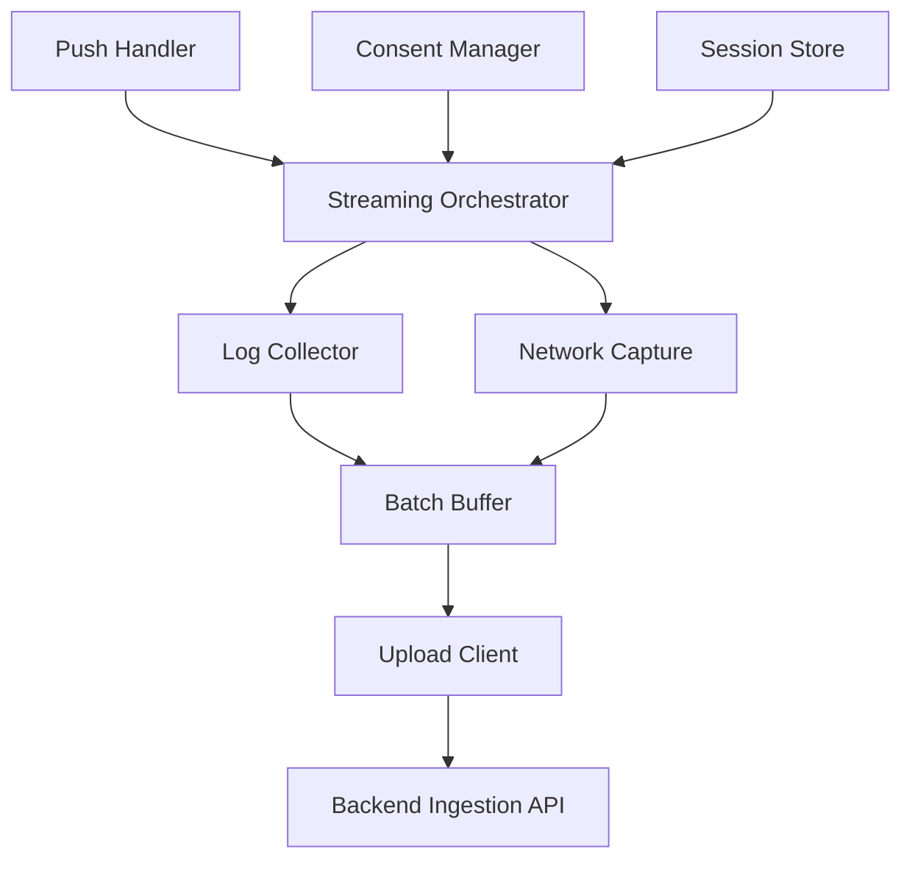

# High Level Design

## Title
Mobile Log Streamer Phase 1 HLD for iOS Mobile

## Document Status
Draft

## Prepared On
June 28, 2026

## Source Documents

- [BRD-mobile-log-streamer.md](/Users/atiqaakif/Documents/logs_stream/BRD-mobile-log-streamer.md)
- [PRD-mobile-log-streamer.md](/Users/atiqaakif/Documents/logs_stream/PRD-mobile-log-streamer.md)
- [HLD-mobile-be-log-streamer.md](/Users/atiqaakif/Documents/logs_stream/HLD-mobile-be-log-streamer.md)

## Purpose
This document defines the phase 1 high level design for the iOS side of the Mobile Log Streamer solution. It focuses on the in-app logging library, session lifecycle on device, consent flow, app and network log capture, and upload behavior.

## Phase 1 Scope

- iOS only
- Push-triggered start and stop
- Single active session per device
- App logs and network logs
- Foreground-only streaming
- Consent prompt before logging begins
- Session persistence across app relaunch
- Automatic resume for the same active session
- `URLSession` network capture only in phase 1

## Design Goals

- Keep logging isolated from feature code
- Provide a reusable library for multiple apps
- Respect iOS foreground-only limitations for phase 1
- Minimize runtime overhead during active sessions
- Keep session handling deterministic and easy to debug
- Use a library-owned logging system rather than depending on the host app logging framework

## Non-Goals

- Android support
- Background-only log streaming
- Search or storage logic on device
- Operator authorization logic
- Long-term offline queue design

## Mobile Architecture Overview

## Main Components

### 1. Push Handler
Receives push notifications and forwards relevant commands to the library.

Responsibilities:

- Parse start and stop commands
- Extract `sessionId`
- Extract high-level session instructions
- Extract short-lived upload session token
- Hand off control to the `Streaming Orchestrator`

### 2. Streaming Orchestrator
Core mobile state machine for the library.

Responsibilities:

- Enforce single active session per device
- Validate whether a new session can start
- Coordinate consent, collection, buffering, and upload
- React to app lifecycle changes
- Transition between session states

Expected client-side states:

- `idle`
- `pending_consent`
- `active`
- `paused`
- `stopping`
- `completed`
- `cancelled`

### 3. Consent Manager
Owns the consent flow for a session.

Responsibilities:

- Render and present the consent prompt from the library itself
- Capture accept or decline result
- Persist consent result for the session
- Prevent re-prompting after relaunch for the same session
- Report consent-shown and consent-denied events back to backend

### 4. Session Store
Stores the active session locally.

Responsibilities:

- Persist `sessionId`
- Persist short-lived upload session token
- Persist consent status
- Persist session configuration required on device
- Restore active session after app relaunch
- Clear state when session ends

Suggested stored fields:

- `sessionId`
- upload session token
- local session status
- consent accepted flag
- start timestamp
- stop policy payload
- config version or hash

### 5. Log Collector
Captures application logs generated by the app and the library.

Responsibilities:

- Use the library-owned logging system as the primary app log capture path
- Provide adapter points for the host app to forward logs into the library logger
- Normalize log format
- Attach session and device metadata
- Forward events to the buffer

### 6. Network Capture
Captures network logs for the active session.

Responsibilities:

- Intercept `URLSession` request and response activity in phase 1
- Capture metadata, headers, and bodies when enabled
- Attach session metadata
- Apply client-side redaction hooks before buffering

### 7. Batch Buffer
Short-lived queue for upload.

Responsibilities:

- Group logs into batched payloads
- Reduce network overhead
- Retry transient failures
- Flush remaining logs on stop

Phase 1 guidance:

- Prefer memory-first buffering
- Keep persistence lightweight
- Avoid building a large offline queue because logging is foreground only

### 8. Upload Client
Sends logs to backend ingestion APIs.

Responsibilities:

- Attach session metadata
- Authenticate upload requests using a short-lived backend-generated session token
- Send batched events
- Retry transient failures with backoff
- Stop retrying once the session ends

## Runtime Flows

### Start Flow

1. App receives start push.
2. Push Handler passes payload to Streaming Orchestrator.
3. Orchestrator validates that no other session is active.
4. Consent prompt is shown.
5. Client reports that the consent prompt was shown so backend can move session to `consent_requested`.
6. If accepted, session is persisted locally.
7. Log collection starts in foreground.
8. Logs are batched and uploaded.

### Stop Flow

1. App receives stop push or local stop condition is met.
2. Orchestrator moves session into stopping state.
3. Upload Client flushes buffered logs.
4. Collectors detach.
5. Session Store is cleared.

### Relaunch Flow

1. App relaunches.
2. Session Store restores the previous active session.
3. If consent was already granted and the session is still active, logging resumes on next foreground entry.

### Consent Denied Flow

1. Start push is received.
2. Consent prompt is shown.
3. User declines.
4. Client sends an explicit cancellation event to backend.
5. No logging starts.
6. Local state is marked cancelled until session cleanup completes.

## App Lifecycle Behavior

### Foreground

- If there is an active session and consent exists, logging runs
- App and network logs are captured
- Upload continues normally

### Background

- Logging pauses
- No foreground-only capture continues
- Session state remains persisted

### Relaunch

- State is restored
- Logging resumes only when the app returns to foreground

## Data Handled on Device

### Session Metadata

- `sessionId`
- short-lived upload session token
- app version
- OS version
- device or install identifier
- user identifier when available
- environment
- consent status

### Log Types

- App logs
- Network metadata
- Request headers
- Response headers
- Full request bodies when enabled
- Full response bodies when enabled

## Security and Privacy

- Logging starts only after user consent
- Sensitive data handling is configurable
- Client-side redaction hooks should run before upload
- Backend remains the final enforcement layer for redaction and policy validation
- Full payload capture must be explicitly enabled
- Session data stored locally should be minimal
- App local storage is sufficient for phase 1 session persistence

## Reliability and Failure Handling

### Start Push Not Delivered

- Nothing starts on device
- No fallback device behavior is required in phase 1

### Upload Failure

- Buffer retries transient failures
- Session remains active while app is foregrounded and stop conditions are not met

### Stop Push Not Delivered

- Device continues using configured stop or expiry behavior
- Default backup behavior is session expiry after backend-configured `N` minutes

### App Relaunch

- Session state is restored
- Logging resumes automatically for the same session

## Mobile Boundaries

The mobile library should not own:

- Session creation
- Operator access control
- Search and retrieval
- Long-term retention
- Global audit and compliance records

These are backend responsibilities.

## Observability

Recommended mobile-side metrics or signals:

- push received count
- consent accepted count
- consent denied count
- active session count
- upload success and failure count
- buffered batch size
- resume after relaunch count

## Ownership

Expected mobile team ownership:

- iOS library
- consent UI integration
- app log integration
- network interception
- local session persistence
- upload client

## Open Items for LLD

- Exact push payload format on device
- Exact iOS persistence mechanism in app local storage
- Exact app logging integration method
- Exact `URLSession` interception method
- Exact redaction hooks and field classification
- Exact retry policy, batch sizing, and transport limits without truncating intended full bodies

## Recommendation
Proceed to a mobile low-level design for the session state machine, iOS lifecycle hooks, consent flow, network interception, batching, and upload contract integration.
