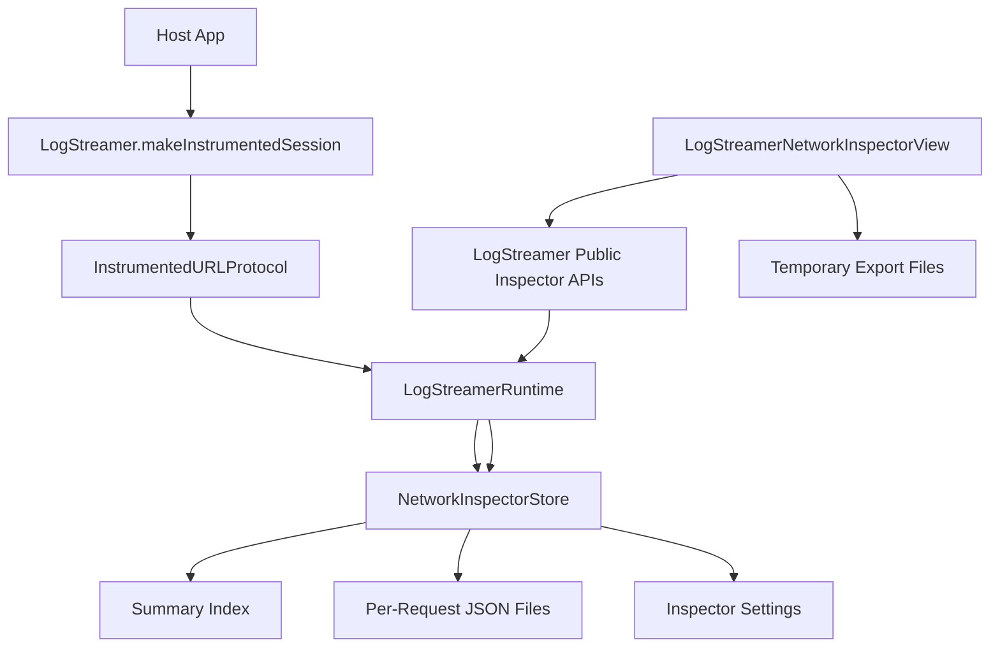
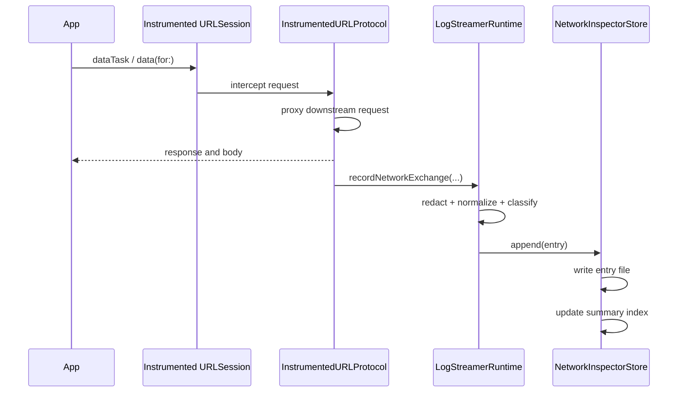

# High Level Design

## Title
LogStreamerKit Network Inspector High Level Design

## Document Status
Draft

## Prepared On
July 9, 2026

## Source Artifacts

- [ios/HLD-mobile-log-streamer.md](/Users/atiqaakif/Documents/logs_stream/ios/HLD-mobile-log-streamer.md)
- [ios/LLD-mobile-log-streamer.md](/Users/atiqaakif/Documents/logs_stream/ios/LLD-mobile-log-streamer.md)
- [ios/Sources/LogStreamerKit/Public/LogStreamer.swift](/Users/atiqaakif/Documents/logs_stream/ios/Sources/LogStreamerKit/Public/LogStreamer.swift)
- [ios/Sources/LogStreamerKit/Core/LogStreamerRuntime.swift](/Users/atiqaakif/Documents/logs_stream/ios/Sources/LogStreamerKit/Core/LogStreamerRuntime.swift)
- [ios/Sources/LogStreamerKit/Network/NetworkInspectorStore.swift](/Users/atiqaakif/Documents/logs_stream/ios/Sources/LogStreamerKit/Network/NetworkInspectorStore.swift)
- [ios/Sources/LogStreamerKit/Public/LogStreamerNetworkInspectorView.swift](/Users/atiqaakif/Documents/logs_stream/ios/Sources/LogStreamerKit/Public/LogStreamerNetworkInspectorView.swift)

## Purpose
This document defines the architecture of the in-app Network Inspector built into `LogStreamerKit`. It focuses on how network traffic is captured, normalized, persisted, filtered, and presented inside the app for local diagnostic inspection.

The scope of this document is the iOS and macOS package implementation of the inspector itself, not backend ingestion or live streaming.

## Scope

### In Scope

- `URLSession` interception through `LogStreamer.makeInstrumentedSession`
- Local capture of request and response metadata
- Local persistence of network inspector entries
- Per-entry storage optimization for large request volumes
- Inspector settings persistence
- In-app list and detail views
- Body type detection and preview behavior
- Single-entry and full-session export for sharing

### Out of Scope

- Backend-side log ingestion and search
- Non-`URLSession` transport capture
- Packet-level inspection
- Cross-device sync of inspector data
- RBAC or authenticated share workflows

## Design Goals

- Keep capture lightweight enough for debug and support workflows
- Avoid one large monolithic file for thousands of requests
- Preserve full request and response detail without making the list expensive
- Support quick local filtering and inspection
- Make export simple for one request or a full captured session
- Keep the inspector independent from the backend session lifecycle

## Key Requirements Addressed

- Persist inspector data locally
- Avoid a single heavy file for large sessions
- Support many captured requests efficiently
- Provide share/export for one request or a whole session
- Persist user configuration such as reset behavior and ignored hosts
- Show clear request and response sections in details
- Keep large bodies out of the list view and use detail drill-down
- Detect and format common content types such as JSON and HTML
- Support search and endpoint filtering in the list view

## Architecture Overview



## Main Components

### 1. Instrumented Session Factory
Defined in [InstrumentedURLSessionFactory.swift](/Users/atiqaakif/Documents/logs_stream/ios/Sources/LogStreamerKit/Network/InstrumentedURLSessionFactory.swift).

Responsibilities:

- Inject `InstrumentedURLProtocol` into a session configuration
- Preserve host app protocol classes where possible
- Ensure requests are intercepted only once

### 2. Instrumented URL Protocol
Also defined in [InstrumentedURLSessionFactory.swift](/Users/atiqaakif/Documents/logs_stream/ios/Sources/LogStreamerKit/Network/InstrumentedURLSessionFactory.swift).

Responsibilities:

- Proxy the request through a downstream `URLSession`
- Measure request start and finish time
- Return the original response to the caller unchanged
- Forward the captured request and response data to `LogStreamerRuntime`

### 3. LogStreamer Runtime
Defined in [LogStreamerRuntime.swift](/Users/atiqaakif/Documents/logs_stream/ios/Sources/LogStreamerKit/Core/LogStreamerRuntime.swift).

Responsibilities:

- Normalize request and response capture into `LogStreamerNetworkEntry`
- Apply header and payload redaction already configured for the SDK
- Pass inspector entries into the local store
- Expose inspector read, clear, export, and settings APIs through `LogStreamer`

### 4. Network Inspector Store
Defined in [NetworkInspectorStore.swift](/Users/atiqaakif/Documents/logs_stream/ios/Sources/LogStreamerKit/Network/NetworkInspectorStore.swift).

Responsibilities:

- Persist entries to disk
- Maintain a lightweight summary index
- Maintain persisted settings
- Enforce maximum retained entry count
- Apply ignored-host filtering before persistence
- Rebuild the index from disk when needed
- Export single-entry or full-session JSON files for sharing

### 5. Inspector UI
Defined in [LogStreamerNetworkInspectorView.swift](/Users/atiqaakif/Documents/logs_stream/ios/Sources/LogStreamerKit/Public/LogStreamerNetworkInspectorView.swift).

Responsibilities:

- Show a compact list of captured requests
- Support search by request URL
- Support method, status, and endpoint filters
- Present settings for reset-on-launch and ignored hosts
- Navigate to a request detail screen with separate request and response sections
- Present dedicated body detail views for large or renderable content

## Data Model

### Full Entry Model
`LogStreamerNetworkEntry` stores the canonical request and response record:

- request method
- URL
- start and finish timestamps
- duration
- request headers
- request body
- response status
- response headers
- response body
- error description

This model is stored as one JSON file per request.

### Summary Model
`LogStreamerNetworkEntrySummary` stores the list-optimized record:

- request method
- URL, path, endpoint
- duration
- response status
- request and response content types
- lightweight body metadata
- error state

The summary model is stored in a central index file and is used for list rendering and filtering.

### Settings Model
`LogStreamerNetworkInspectorSettings` persists:

- `resetOnAppLaunch`
- `ignoredHosts`

## Persistence Design

### Storage Strategy
The inspector uses sharded persistence instead of a single file.

```text
Application Support/
  LogStreamer/
    network-inspector/
      index.json
      settings.json
      entries/
        <request-id-1>.json
        <request-id-2>.json
        <request-id-3>.json
```

### Why This Design

- Writing one file per request avoids repeatedly rewriting one very large blob
- The list can load from `index.json` without decoding every full request body
- Individual entries can be deleted or exported independently
- Rebuilding from the `entries/` directory remains possible if the index is missing or corrupted

### Capacity Control

- `networkInspectorMaxEntries` limits retained request count
- Once the limit is exceeded, the oldest entries are removed
- Trimming removes both the summary index entry and the per-request file

### Launch Behavior

- Settings are loaded first
- The summary index is loaded next, or rebuilt from `entries/`
- If `resetOnAppLaunch` is enabled, persisted entries are cleared during initialization

## Capture Flow



## Read and UI Flow

### List Screen

- Loads `LogStreamer.networkEntrySummaries()`
- Renders compact cells from the summary index only
- Does not load full bodies for the list
- Supports:
  - search by request URL
  - method filter
  - status filter
  - endpoint filter

### Detail Screen

- Loads `LogStreamer.networkEntry(id:)`
- Shows:
  - summary
  - request section
  - response section
  - headers
  - request and response bodies
  - cURL for replay

### Body Detail Screen

- Used when the request or response body is large or rich
- Shows a shortened preview in the parent detail view
- Opens a dedicated screen for the full body
- Renders HTML through `WebKit` where supported
- Pretty-prints JSON where possible

## Content Type Detection

Body classification is handled in `NetworkInspectorBodyFormatter`.

Supported categories:

- `json`
- `html`
- `xml`
- `text`
- `binary`
- `none`

Detection uses:

- `Content-Type` header when available
- cheap body-prefix heuristics when the header is missing or ambiguous

The design intentionally avoids heavy content sniffing or expensive parsing for every request.

## Filtering Model

### Persisted Filters

- ignored hosts
- reset-on-launch setting

These affect persisted capture behavior.

### Runtime UI Filters

- request method
- status bucket
- endpoint selection
- search text

These affect presentation only and do not modify stored data.

### Ignored Host Enforcement

- host names are normalized to lowercase
- ignored hosts are applied before persistence
- changing ignored hosts later prunes already stored matching entries

## Export and Sharing

### Single Entry Export

- The store loads one request by ID
- Serializes it as JSON
- Writes a temporary export file
- The UI opens the system share sheet or sharing picker

### Full Session Export

- The store packages current settings and all retained entries
- Serializes them as one JSON export artifact
- Writes a temporary export file
- The UI shares the file through the system picker

## Performance Considerations

- Full entry bodies are not needed for list rendering
- The compact list uses summaries only
- Per-entry files reduce write amplification for large sessions
- JSON formatting is deferred to entry creation and detail display rather than repeated in the list
- HTML rendering happens only in the body detail screen

## Failure Handling

- If a per-entry file fails to write, the append is skipped and the runtime logs the failure
- If the index is unreadable, the store rebuilds it from the entry files
- If a specific entry file is missing, the list can still render from the index, but detail retrieval for that item will return `nil`
- Corrupted settings fall back to defaults

## Security and Privacy

- Inspector capture inherits the SDK’s redaction rules
- Ignored hosts reduce unwanted local persistence for known endpoints
- Export is local and manual; there is no automatic network share path in this feature
- Reset-on-launch provides an additional local privacy control for sensitive debug sessions

## Known Constraints

- Capture currently depends on host apps using `LogStreamer.makeInstrumentedSession`
- The inspector is local to the app install and not synced
- Non-`URLSession` stacks are outside phase 1
- Very large binary payloads are stored as strings from the capture layer’s existing display conversion path

## Future Extensions

- size-based capture limits per request body
- richer response timing breakdown
- host filter UI in the list itself
- pinning or bookmarking interesting requests
- richer export formats such as cURL bundles or HAR-like output
- optional grouping by endpoint or request family

## Summary
The Network Inspector is designed as a local, low-overhead inspection tool on top of `LogStreamerKit`. Its core architectural decision is to separate list summaries from full request records and persist each request independently. That design directly supports large session volumes, compact UI rendering, selective sharing, persisted configuration, and richer detail inspection without pushing the entire cost of full request bodies into every list operation.
