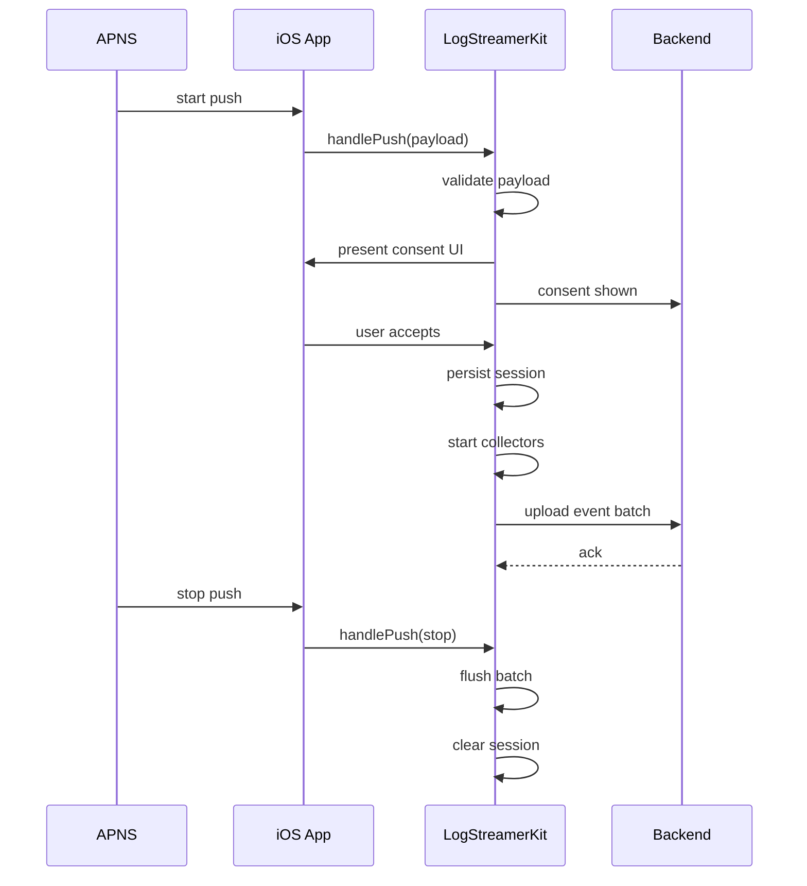

# Low Level Design

## Title
Mobile Log Streamer Phase 1 LLD for iOS Mobile

## Document Status
Draft

## Prepared On
June 28, 2026

## Source Documents

- [BRD-mobile-log-streamer.md](/Users/atiqaakif/Documents/logs_stream/BRD-mobile-log-streamer.md)
- [PRD-mobile-log-streamer.md](/Users/atiqaakif/Documents/logs_stream/PRD-mobile-log-streamer.md)
- [HLD-mobile-log-streamer.md](/Users/atiqaakif/Documents/logs_stream/ios/HLD-mobile-log-streamer.md)

## Purpose
This document converts the iOS HLD into implementation-level design for the phase 1 mobile library.

## Phase 1 Implementation Choices

- Platform: `iOS`
- Network stack supported: `URLSession` only
- Library-owned app logging system
- Library-owned consent UI
- Local persistence: app local file storage
- Foreground-only log collection
- Upload auth: short-lived backend-generated session token

## iOS Tech Direction

- Language: `Swift 6` compatible source style
- Packaging: Swift Package or internal framework
- Concurrency: `async/await` plus actors for session-safe state
- Serialization: `Codable`
- Persistence: JSON file under app `Application Support`
- Networking: `URLSession`

## Library Modules

```text
LogStreamerKit/
  Public/
    LogStreamer.swift
    LogStreamerConfig.swift
    LogStreamerLogger.swift
    InstrumentedURLSessionFactory.swift
  Core/
    StreamingOrchestrator.swift
    SessionStateMachine.swift
    SessionModels.swift
    SessionActor.swift
  Push/
    PushPayloadParser.swift
    PushCommandHandler.swift
  Consent/
    ConsentManager.swift
    ConsentViewController.swift
  Logging/
    AppLogger.swift
    LogCollector.swift
    LogEventNormalizer.swift
  Network/
    NetworkCaptureInterceptor.swift
    URLSessionTaskObserver.swift
  Buffer/
    BatchBuffer.swift
    BatchFlushPolicy.swift
  Upload/
    UploadClient.swift
    UploadRequestBuilder.swift
  Storage/
    SessionStore.swift
  Redaction/
    RedactionEngine.swift
  Lifecycle/
    AppLifecycleBridge.swift
```

## Public API Surface

### Host App Integration API

```swift
public enum LogStreamer {
    public static func initialize(config: LogStreamerConfig)
    public static func handlePush(userInfo: [AnyHashable: Any]) async
    public static func applicationDidBecomeActive() async
    public static func applicationDidEnterBackground() async
    public static func applicationWillTerminate() async
    public static var logger: LogStreamerLogger { get }
    public static func makeInstrumentedSession(
        configuration: URLSessionConfiguration,
        delegate: URLSessionDelegate?,
        delegateQueue: OperationQueue?
    ) -> URLSession
}
```

### Host App Responsibilities

- Call `initialize` during app startup
- Route APNs payloads to `handlePush`
- Forward foreground/background lifecycle callbacks
- Use `LogStreamer.logger` for app logs, or bridge existing logs into it
- Use `makeInstrumentedSession` for network traffic that must be captured in phase 1

## Domain Models

### ClientSessionState

```swift
enum ClientSessionState: String, Codable {
    case idle
    case pendingConsent
    case consentAccepted
    case active
    case paused
    case stopping
    case completed
    case cancelled
}
```

### StartSessionPayload

```swift
struct StartSessionPayload: Codable {
    let sessionId: String
    let uploadToken: String
    let appId: String
    let environment: String
    let logLevel: String
    let captureNetworkBodies: Bool
    let retentionHours: Int
    let stopPolicy: StopPolicy
    let issuedAt: String
    let expiresAt: String
    let signature: String
}
```

### StopPolicy

```swift
struct StopPolicy: Codable {
    let expiresAfterMinutes: Int
    let maxEvents: Int?
    let maxBytes: Int?
}
```

### PersistedSession

```swift
struct PersistedSession: Codable {
    let sessionId: String
    let uploadToken: String
    let appId: String
    let environment: String
    let state: ClientSessionState
    let consentAccepted: Bool
    let captureNetworkBodies: Bool
    let stopPolicy: StopPolicy
    let startedAt: String
    let lastUpdatedAt: String
}
```

### LogEvent

```swift
struct LogEvent: Codable {
    let eventId: String
    let sessionId: String
    let timestamp: String
    let type: LogEventType
    let level: String?
    let component: String
    let message: String?
    let metadata: [String: String]
    let payload: PayloadBody?
}
```

### LogEventType

```swift
enum LogEventType: String, Codable {
    case app
    case networkRequest
    case networkResponse
    case lifecycle
}
```

## Push Payload Handling

### Supported Commands

- `start_logging`
- `stop_logging`

### Parse Rules

- Ignore pushes with missing `sessionId`
- Ignore start push if another active session exists for a different session ID
- Accept repeated start push for the same session ID as idempotent
- Validate payload signature before acting
- Reject expired upload token or expired push payload

## State Machine

### State Transition Table

| Current | Event | Next | Action |
|---|---|---|---|
| `idle` | valid start push | `pendingConsent` | show consent prompt |
| `pendingConsent` | consent shown callback sent | `pendingConsent` | no-op local state change |
| `pendingConsent` | consent accepted | `consentAccepted` | persist session |
| `consentAccepted` | app foreground | `active` | attach collectors and upload |
| `active` | app background | `paused` | pause collectors |
| `paused` | app foreground | `active` | resume collectors |
| `active` | stop push | `stopping` | flush buffer |
| `paused` | stop push | `stopping` | clear state |
| `pendingConsent` | consent denied | `cancelled` | send cancel event |
| `stopping` | flush success | `completed` | clear state |
| any active-like | expiry reached | `stopping` | stop locally |

### Implementation Direction

- `SessionActor` owns the current state
- All state transitions happen through actor-isolated methods
- UI callbacks post events into the actor, not direct state mutation

## Consent Flow

### Default Consent Copy Inputs

The library view controller accepts:

- title
- message
- accept button label
- decline button label

### Consent Flow Steps

1. `PushCommandHandler` receives valid start push
2. `StreamingOrchestrator` enters `pendingConsent`
3. `ConsentManager` presents `ConsentViewController`
4. Client calls backend `consent-shown` endpoint
5. If user accepts:
   - persist session
   - record accepted flag
   - start collection if app is foregrounded
6. If user declines:
   - call backend `cancel` endpoint
   - move local state to `cancelled`
   - clear session after acknowledgment or short timeout

## Session Persistence

### Storage Location

- File path: `Application Support/LogStreamer/active-session.json`

### SessionStore API

```swift
protocol SessionStore {
    func load() async throws -> PersistedSession?
    func save(_ session: PersistedSession) async throws
    func clear() async throws
}
```

### Persistence Rules

- Only one file is stored for phase 1 because only one active session is allowed
- File is overwritten atomically
- If file is corrupt, clear it and return `nil`

## App Logging Design

### Library-Owned Logger API

```swift
public protocol LogStreamerLogger {
    func debug(_ message: String, component: String, metadata: [String: String])
    func info(_ message: String, component: String, metadata: [String: String])
    func warn(_ message: String, component: String, metadata: [String: String])
    func error(_ message: String, component: String, metadata: [String: String])
}
```

### Logging Rules

- App logs are recorded only while a session is active
- Logs outside an active session are dropped by the collector
- Logger writes into an internal async stream consumed by `LogCollector`

## Network Capture Design

### Chosen Strategy

Phase 1 will use library-created `URLSession` instances instead of global swizzling.

Reason:

- deterministic scope
- lower runtime risk
- easier rollout inside one app

### Instrumentation Design

- Host app creates sessions via `makeInstrumentedSession`
- Library injects `NetworkCaptureInterceptor`
- Interceptor wraps task creation and completion callbacks
- Request and response are normalized into `LogEvent`

### Captured Network Fields

- request URL
- HTTP method
- headers
- request body when enabled
- response status code
- response headers
- response body when enabled
- start timestamp
- end timestamp
- latency milliseconds
- error description if failed

## Redaction Design

### Ownership

- mobile applies first-pass redaction
- backend applies final enforcement

### RedactionEngine Inputs

- header allowlist or denylist
- body field rules
- token field rules
- custom host app rule hook

### Redaction Order

1. build raw captured event
2. apply header redaction
3. apply body redaction
4. normalize to upload model
5. queue for upload

## Buffering and Flush Design

### BatchFlushPolicy

Proposed phase 1 defaults:

- flush every `2 seconds`
- flush when `100` events are buffered
- flush when serialized batch reaches about `512 KB`

### Full Request and Response Bodies

- No product-level truncation is applied by default
- If one single event exceeds normal batch size, upload it in its own request
- Hard transport rejection is handled by backend response and logged as an upload error

### BatchBuffer API

```swift
protocol BatchBuffer {
    func append(_ event: LogEvent) async
    func drainForUpload() async -> [LogEvent]
    func flushNow() async -> [LogEvent]
    func count() async -> Int
}
```

## Upload Design

### Endpoints Used

- `POST /api/v1/mobile/sessions/{sessionId}/consent-shown`
- `POST /api/v1/mobile/sessions/{sessionId}/cancel`
- `POST /api/v1/mobile/sessions/{sessionId}/events`

### Headers

- `Authorization: Bearer <uploadToken>`
- `X-App-Id`
- `X-Installation-Id`
- `X-Device-Id`
- `X-Request-Id`

### Upload Request Body

```json
{
  "sessionId": "sess_123",
  "sentAt": "2026-06-28T10:00:00Z",
  "events": [
    {
      "eventId": "evt_1",
      "timestamp": "2026-06-28T10:00:00Z",
      "type": "app",
      "level": "INFO",
      "component": "CheckoutViewModel",
      "message": "Checkout started",
      "metadata": {
        "screen": "checkout"
      }
    }
  ]
}
```

### Retry Policy

Proposed phase 1 defaults:

- max retries: `3`
- backoff: `1s`, `2s`, `4s`
- retry on network timeout, connection loss, HTTP `429`, HTTP `5xx`
- do not retry on HTTP `401`, `403`, `404`, `422`

## Lifecycle Integration

### Required Host App Hooks

- `didFinishLaunching`
- `didReceiveRemoteNotification`
- `sceneDidBecomeActive` or `applicationDidBecomeActive`
- `sceneDidEnterBackground` or `applicationDidEnterBackground`
- `applicationWillTerminate`

### Foreground Rules

- Collection starts only in foreground
- Resume only if session exists and consent was already granted

### Background Rules

- New events are not collected
- Buffer may flush one final batch if allowed before suspension

## Error Handling

### Client Error Codes

- `LS001`: invalid push payload
- `LS002`: signature validation failed
- `LS003`: session conflict
- `LS004`: persistence failure
- `LS005`: upload auth failed
- `LS006`: upload transport failure
- `LS007`: consent callback failed

### Failure Behavior

- Parsing failures do not crash app
- Upload failures do not block app usage
- Persistent corruption clears local state and logs an internal error

## Sequence Diagram



## Testing Strategy

### Unit Tests

- state machine transitions
- session persistence load and clear
- redaction rules
- buffer flush thresholds
- retry classification

### Integration Tests

- start push to active upload
- consent denied flow
- relaunch and foreground resume
- stop push flush
- URLSession request and response capture

### Manual Test Scenarios

- app foreground happy path
- relaunch during active session
- background then foreground resume
- invalid token
- network offline during upload

## Open Items

- final consent copy
- final host app adapter points for existing logs
- final event volume thresholds after performance testing
- final oversized-event handling if backend enforces request-size caps

## Recommendation
Proceed to implementation with the session actor, file-backed session store, library-owned logger, instrumented `URLSession` factory, and batched upload client as the first build slice.
